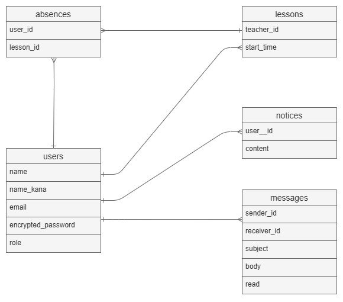
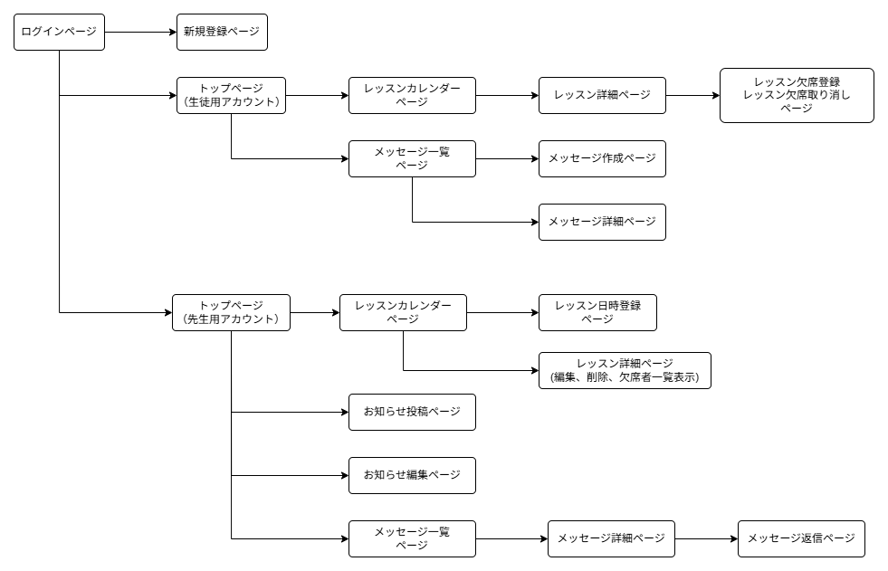

# アプリケーション名
レッスン管理くん  

# アプリケーション概要
個人教室の先生が、レッスン日時の管理、生徒との連絡ツールとして気軽に使える、最低限の必要機能だけを搭載したシンプルなアプリ

# URL
https://lessonkanrikun.onrender.com

# テスト用アカウント
- Basic認証ID : admin
- Basic認証パスワード : 2222
- メールアドレス(先生用アカウント) : emi@mm.com
- パスワード（先生用アカウント）: a123456
- メールアドレス（生徒用アカウント）: sara@mm.com
- パスワード（生徒用アカウント）: b123456

# 利用方法

# アプリケーションを作成した背景
子どもの習い事や塾での連絡が主にグループLINEで行われている中で、出欠の連絡や重要なお知らせといった本当に必要な情報が、日々の雑談や他の通知に埋もれてしまうという課題を感じました。  
実際に自身の経験に加え、教室の先生方に話を聞いたところ、「便利なアプリは多いが、機能が多すぎて扱いづらい」「もっとシンプルで直感的に使えるものが欲しい」という声もありました。  
こうした背景から、必要な情報だけを簡潔にやり取りできる、シンプルな出欠管理＆連絡アプリを開発しました。  

# 工夫したポイント
画面遷移を最小限に抑え、直感的に使えるUIを意識しました。
ユーザーが迷わず操作できるよう、機能ごとの導線をシンプルに設計しています。

連絡機能は「LINEのようにならない」ことを重視しました。
先生からの連絡は「お知らせ投稿」として一括周知、生徒からの連絡は先生への個別メッセージに限定。
双方向のチャット形式ではなく、やり取りを最小限にすることで、
情報が埋もれず、必要な内容が明確に伝わるように設計しています。

# テーブル設計

# 画面遷移図

# 開発環境
OS：Windows 11 Home (Ubuntu 24.04.1)  
言語：Ruby 3.2.0  
フレームワーク：Ruby on Rails 7.1.5.1  
フロントエンド：HTML / CSS  
データベース：MySQL 8.0.40  
認証：Devise  
テスト：RSpec / FactoryBot  
エディタ：Visual Studio Code  
バージョン管理：Git / GitHub  

# テーブル設計

## usersテーブル

| Column             | Type   | Options                   |
|--------------------|--------|---------------------------|
| name               | string | null: false               |
| name_kana          | string | null: false               |
| email              | string | null: false               |
| encrypted_password | string | null: false, unique: true |
| role               | string | null: false               |

### Association

has_many :lessons, foreign_key: :teacher_id 
has_many :absences  
has_many :absent_lessons, through: :absences, source: :lesson  
has_many :notices  
has_many :sent_messages, class_name: "Message", foreign_key: "sender_id"  
has_many :received_messages, class_name "Message", foreign_key: "receiver_id"  

## absencesテーブル

| Column    | Type        | Options                        |
|-----------|-------------|--------------------------------|
| user_id   | references  | null: false, foreign_key: true |
| lesson_id | references  | null: false, foreign_key: true |

### Association

belongs_to :user  
belongs_to :lesson

## lessonsテーブル

| Column     | Type       | Options                        |
|------------|------------|--------------------------------|
| teacher_id | references | null: false, foreign_key: true |
| start_time | datetime   | null: false                    |

### Association

belongs_to :teacher, class_name: "User"  
has_many :absences  
has_many :absent_students, through: :absences, source: :user  

## noticesテーブル

| Column     | Type       | Options                        |
|------------|------------|--------------------------------|
| user_id    | references | null: false, foreign_key: true |
| content    | text       | null: false                    |

### Association

belongs_to :user   

## messagesテーブル

| Column      | Type       | Options                        |
|-------------|------------|--------------------------------|
| sender_id    | references | null: false, foreign_key: true |
| receiver_id  | references | null: false, foreign_key: true |
| subject     | string     | null: false                    |
| body        | text       | null: false                    |
| read        | boolean    | default: false                 |

### Association

belongs_to :sender, class_name: 'User'  
belongs_to :receiver, class_name: 'User'  
